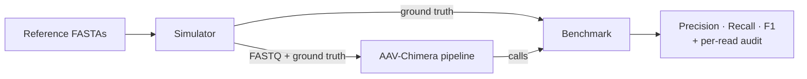

<h1 align="center">AAV-Chimera</h1>

<p align="center">
  <b>Benchmark-validated chimeric read detection for AAV vectors on Oxford Nanopore.</b><br>
  <sub>A detection pipeline, a ground-truth read simulator, and the benchmark that scores one against the other.</sub>
</p>

<p align="center">
  <a href="https://github.com/Victor-Alfred/aav-chimera/actions/workflows/ci.yml"></a>
  <a href="https://github.com/Victor-Alfred/aav-chimera/actions/workflows/benchmark.yml"></a>
  
  
  
  
</p>

---

Recombination during AAV production creates **chimeric molecules** — single reads spanning the
vector genome, helper plasmid, and host DNA. They are the hardest species to call correctly:
they masquerade as ordinary reads, and a naive caller either misses them or floods the report
with false alarms.

AAV-Chimera detects them from split-read alignment signatures and **proves the accuracy of every
call**. A companion simulator generates Nanopore reads with known chimeric ground truth, so the
numbers below aren't estimates — they're measured against labelled data, and regenerated by CI.

Chimeric detection sits inside a full vector-QC pipeline (genome-structure classification, ITR
truncation, backbone read-through, host contamination), so the detector runs in the context it
was designed for rather than in isolation.

> **Note** — this is an independent implementation, not related to Oxford Nanopore's
> `wf-aav-qc` EPI2ME workflow. The focus here is chimeric-junction detection and the
> simulation-based validation harness around it.

## Results

Chimeric-read detection on **5,071** simulated reads with known ground truth:

<p align="center">
  
  
</p>

| Precision | Recall | Specificity | F1 | Accuracy |
| :---: | :---: | :---: | :---: | :---: |
| **1.000** | 0.947 | **1.000** | **0.973** | 0.995 |

**Zero false positives across 4,564 non-chimeric reads.** For a QC gate, a false positive means
needlessly flagging a good lot — so precision is the metric that matters, and it's perfect here.
The 27 missed calls are the honest cost of that conservatism. Backbone detection reaches 0.957
sensitivity at 1.000 precision. Full methodology in [`docs/benchmarks.md`](docs/benchmarks.md).


## How it validates itself



The simulator emits ground truth in the *same schema* the pipeline outputs, so benchmarking is a
direct read-by-read comparison. On every push, CI regenerates the figures above from the committed
results — the plots can't drift from the data. Architecture details in [`docs/architecture.md`](docs/architecture.md).

## Features

**Analysis pipeline (`aav-chimera`)**
- Genome-structure classification: ssAAV, scAAV, snapback, GDM, ICG, backbone
- Chimeric detection from split-read (SA-tag) segments with junction analysis
- ITR-truncation logic driven by explicit plasmid coordinates
- Backbone and host-DNA contamination detection
- Single-pass BAM analysis, piped minimap2 alignment, combined-reference caching
- Per-base transgene coverage, strand-bias, concatemer/over-packaging detection
- Pre/post-filter NanoPlot QC, HTML reports, checkpointing, parallel samples

**Simulator + benchmark (`aav-chimera-sim`)**
- Context-dependent Nanopore error model (homopolymer + burst errors)
- Configurable chimeric / backbone / host / unmapped proportions
- Microhomology and insertion junctions with recorded ground truth
- Precision / recall / F1 with a per-read TP/FP/FN/TN audit trail

## Quickstart

```bash
# 1. Install the package (Python 3.9+)
pip install -e ".[dev]"

# 2. External tools the pipeline shells out to:
#    minimap2, samtools, porechop, NanoFilt, NanoPlot
#    (conda-forge / bioconda recommended)

# 3. Run QC on a directory of Nanopore FASTQs
aav-chimera \
  --raw-fastq-dir /data/fastq \
  --work-dir ./qc_run \
  --refs-dir /data/refs \
  --transgene-name "pAAV-CMV-eGFP" \
  --itr-5-start 0 --itr-5-end 145 \
  --itr-3-start 4331 --itr-3-end 4472
```

Reproduce the full benchmark end-to-end (`simulate → qc → benchmark`):

```bash
REF_DIR=/path/to/refs ./examples/run_benchmark.sh
```

## Repository layout

```
aav-chimera/
├── src/aav_chimera/
│   ├── qc.py                 # analysis pipeline  (aav-chimera)
│   └── simulator.py          # simulator + benchmark  (aav-chimera-sim)
├── tests/                    # unit tests for CIGAR/SA/junction/error-model logic
├── scripts/make_figures.py   # regenerate figures from results/
├── results/                  # benchmark JSON, per-read CSV, figures
├── docs/                     # architecture + benchmark methodology
├── examples/run_benchmark.sh # end-to-end reproduction
└── .github/workflows/        # CI (lint+test) and Benchmark (figures+metrics)
```

## Roadmap

- Raise reference-pair accuracy on multi-segment chimeras (currently ~83%)
- Additional error-model presets for newer Nanopore chemistries
- Optional Snakemake/Nextflow wrapper for multi-sample cohorts

## License & citation

MIT — see [`LICENSE`](LICENSE). If you use this in academic work, please cite via
[`CITATION.cff`](CITATION.cff).
