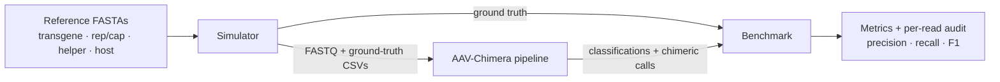
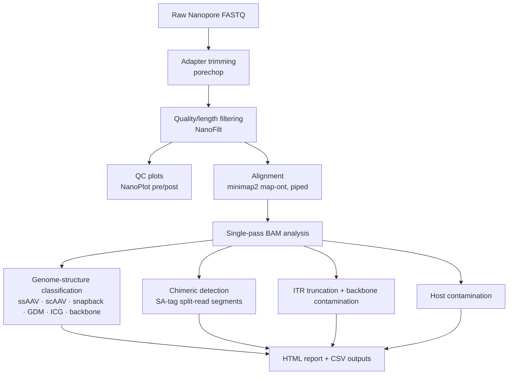

# Architecture

The toolkit is two cooperating components: an **analysis pipeline** that scores real
sequencing runs, and a **simulator** that generates reads with known ground truth so the
pipeline can be validated quantitatively.

## The self-validating loop



Because the simulator writes ground truth in the *same schema* the pipeline emits, the
benchmark is a direct, read-by-read comparison — no manual label reconciliation.

## Detection pipeline stages (`aav_chimera.qc`)



Design choices worth noting:

- **Single-pass BAM analysis.** Classification, chimeric detection, coverage, and strand-bias
  are computed in one traversal of the alignment rather than repeated passes.
- **Piped alignment.** minimap2 output is consumed without writing an intermediate SAM.
- **Combined-reference caching.** The concatenated, ITR-masked reference is built once and reused.
- **Explicit ITR coordinates.** Truncation logic uses annotated plasmid coordinates rather than
  inferring ITR boundaries, which removes a common source of misclassification.

## Simulator (`aav_chimera.simulator`)

Generates five read populations with controllable proportions:

| Category | What it models |
| --- | --- |
| `normal` | Full/partial packaged genome (ITR-to-ITR), both orientations |
| `chimeric` | 2–4 segments from different references joined at junctions with microhomology or insertions |
| `backbone` | Read-through past the ITRs and pure-backbone contamination |
| `host` | Host-genome contamination reads |
| `unmapped` | Reads that should not map to any reference |

The error model is context-dependent: substitutions/insertions/deletions at a configurable base
rate, elevated homopolymer-length errors, and a burst ("clustered") error mode approximating
Nanopore behaviour. Ground truth (chimeric status, backbone status, reference order, truncation
category) is written alongside the FASTQ.

## Output schema

The benchmark consumes and produces per-read rows so every metric is auditable:

```
read_name, ground_truth_chimeric, ground_truth_backbone,
pipeline_detected_chimeric, pipeline_classified_backbone,
classification (TP/FP/FN/TN), ground_truth_refs, detected_refs, ground_truth_category
```
