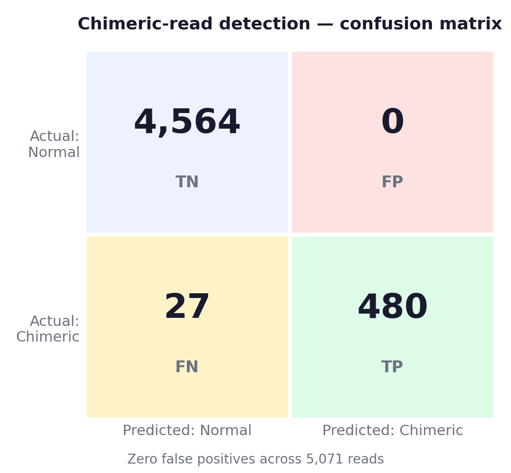
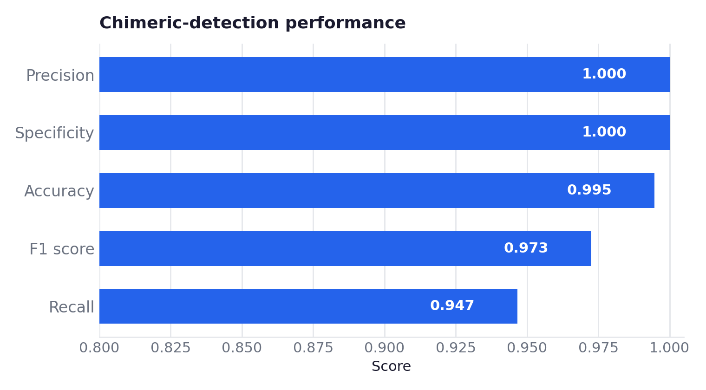
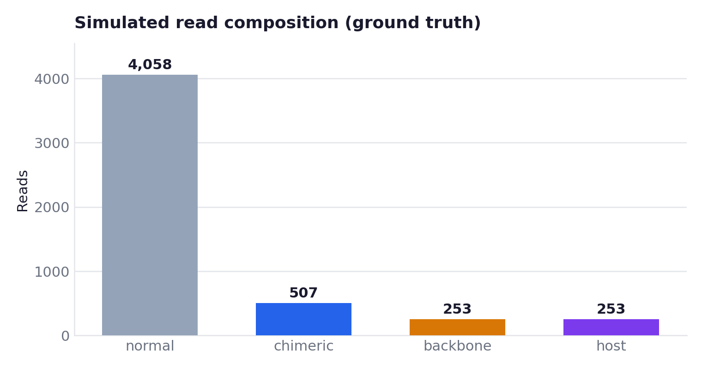

# Benchmarks

All numbers below come from `results/benchmark_results.json` and the per-read audit in
`results/benchmark_per_read.csv`. Figures are regenerated from those files by
`scripts/make_figures.py` (also run in CI), so the plots cannot silently drift from the data.

## Headline result — chimeric-read detection

| Metric | Value |
| --- | --- |
| Precision | 1.0000 |
| Recall (sensitivity) | 0.9467 |
| Specificity | 1.0000 |
| F1 score | 0.9726 |
| Accuracy | 0.9947 |
| True positives | 480 |
| False positives | 0 |
| False negatives | 27 |
| True negatives | 4564 |

The pipeline made **zero false-positive chimeric calls** across 5,071 reads — for a QC gate that
decides whether a vector lot is flagged, false positives are the expensive error, and there were
none. The 27 false negatives are the honest cost of that conservatism.





## Secondary detections

**Backbone contamination** — sensitivity 0.9565, precision 1.0000 (242 TP, 0 FP, 11 FN).

**Host-chimeric detection** — 476 TP, 0 FP, 27 FN.

**Reference-pair accuracy** — when a read *is* correctly called chimeric, the exact set of
contributing references is recovered 83.1% of the time (399/480). This is the hardest sub-task
(it requires getting every segment's reference right, not just the binary call) and is the most
useful lever for future improvement.

## Read composition

The simulated evaluation set (ground truth):



## Reproducing end-to-end

CI validates the code and republishes these figures on every push. To regenerate the *numbers*
from scratch against real references:

```bash
REF_DIR=/path/to/refs ./examples/run_benchmark.sh
```

This runs `simulate → qc → benchmark` and rewrites `results/`. Requires minimap2, samtools,
porechop, NanoFilt, and NanoPlot on `PATH`, plus reference FASTAs (transgene, rep/cap, helper,
and a host genome such as hg38). See `examples/run_benchmark.sh` for the exact invocation and
ITR coordinates.

## Notes on interpretation

- Two independent simulated runs are recorded in `results/benchmark.log`; the featured JSON is
  the second run. Metrics are stable across both (F1 0.970 vs 0.973).
- Thresholds (`--min-chimeric-segment-length`, `--min-chimeric-mapq`) trade recall for precision.
  The committed configuration is tuned toward precision, matching a QC-gating use case.
